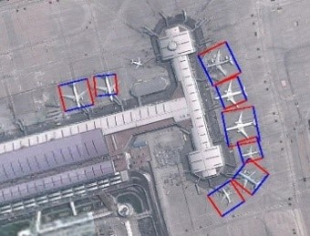
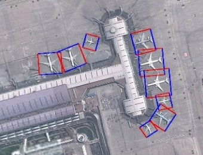
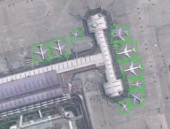

# R-CenterNet
detector for rotated-objections based on CenterNet/基于CenterNet的旋转目标检测

### demo
* R-DLADCN(this code)
    * 
* R-ResDCN(just replace cnn in resnet with dcn)
    * 
* R-DLANet(not use dcn if you don't know how to complie dcn)
    * 
* DLADCN.jpg
    * 

#### notes
 * I refactored the original code partially to make codes more concise.
 * how to complie dcn and run environment, refer to the original code of CenterNet.
 * For data processing and more details, refer to [here](https://zhuanlan.zhihu.com/p/163696749)

### Related projects
* [CenterNet](https://github.com/xingyizhou/centernet)
